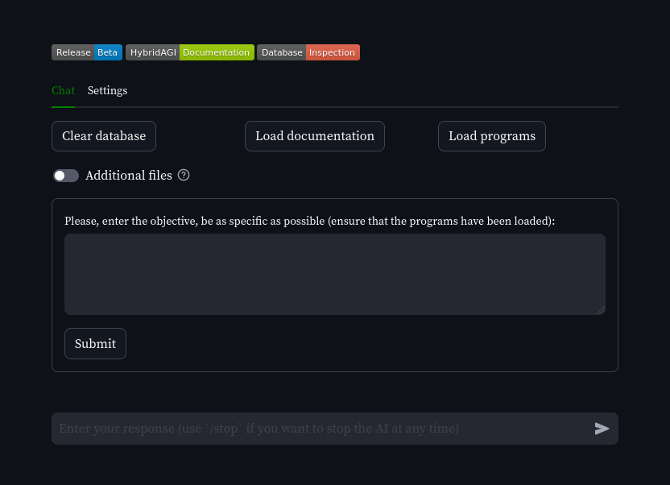

# HybridAGI chat-UI
 [](https://synalinks.github.io/documentation/)

A simple chat UI made with Streamlit to deploy your custom Agents in seconds.

Learn how to program [HybridAGI](https://github.com/SynaLinks/HybridAGI) using [Cypher](https://en.wikipedia.org/wiki/Cypher_(query_language)) to create controlled and explainable Agents!



## Quickstart in 5 simple steps!

#### What you need to start?

- A MistralAI API key (get one at https://mistral.ai/)
- [Git](https://git-scm.com/downloads) and [Docker](https://www.docker.com/products/docker-desktop/)

### Installation

First, clone the chat repository with:

```shell
git clone https://github.com/SynaLinks/HybridAGI-chat
cd HybridAGI-chat
```

### Directory hierarchy

Then you should open the repository folder in your favorite IDE ([VSCodium](https://vscodium.com/) with the Neo4J plugin is a good start).

```shell
📦HybridAGI-chat
┣ 📂archives  # This is where the AGI will save its uploaded work
┣ 📂documentation # This is where you can put your pdf and documents
┣ 📂programs # This is where you should put your Cypher programs
┣ 📂src # The source code of the UI
... the license and other files related to deployment
```

Note that the folders `archives`, `documentation` and `programs` are shared with the application container, you can edit them and reload your programs/documentation without restarting the application container.

### Echo test program

Start with a simple echo test, create a `main.cypher` file inside the `programs` folder:

```javascript
// Nodes declaration
CREATE
(start:Control {name:"Start"}),
(end:Control {name:"End"}),
(echo_objective:Action {
  name:"Reformulate the Objective",
  tool:"Speak",
  prompt:"Please reformulate the objective using other words"}),
// Structure declaration
(start)-[:NEXT]->(echo_objective),
(echo_objective)-[:NEXT]->(end)
```

Learn more about Graph-based Prompt Programming by reading our [documentation](https://synalinks.github.io/documentation/basics/graph-prompt-programming).

### Deploy your app

Now it is time to deploy this app, just use the following command

```
docker-compose up
```

### Inspect the database

Open your browser at [http://localhost:8001](http://localhost:8001) and connect to an existing database with the hostname `falkordb` and port `6379`.